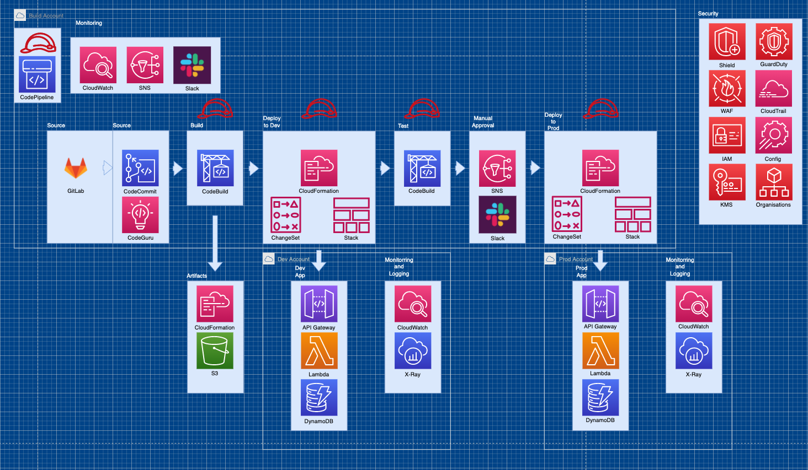

# AWSome AB Project

## Table of Contents

- [Overview](#overview)
  - [Diagrams](#diagrams)
  - [Useful Links](#useful-links)
  - [Test](#tests)
- [Prerequisites](#prerequisites)
  - [Variables](#variables)
- [Quick Start](#quick-start)
  - [Deploy from client machine](#deploy-from-client-machine)
  - [Validate Deployment](#validate-deployment)
  - [clean Up](#clean-up)

## Overview

This repository contains SAM, cloudformation and python code to deploy an basic 3 tier serverless application using AWS code* tools, including unit tests, linting, validation, UI and Load tests. The resources deployed and the architectural pattern they follow is purely for demonstration/testing  purposes.

Enterprise architecture can include many services combined to achieve a large and secure networks.

The following resources will be deployed:
 - API Gateway
 - DynamoDB
 - CloudPipeline
 - CodeBuild
 - S3
 - CloudFront
 - SNS
 - CodeGuru Reviewer
 - KMS
 - Lambda
 - IAM
 - Config

### Diagrams

Architecture Diagram



### Useful Links
 - https://docs.aws.amazon.com/serverless-application-model/latest/developerguide/what-is-sam.html
 - https://aws.amazon.com/lambda/
 - https://docs.aws.amazon.com/codeguru/latest/reviewer-ug/welcome.html
 - https://www.selenium.dev/documentation/
 - https://www.artillery.io/docs/guides/guides/running-tests-with-artillery-pro
 - http://docs.getmoto.org/en/latest/
 - https://docs.aws.amazon.com/codepipeline/latest/userguide/welcome.html

### Tests
 - [Unit Tests](/tests/unit/test_handler.py)
 - [Load Tests](/tests/load/load.yaml)
 - [UI Tests](/test/ui/uitest.py)
 - [Validation](tests/validate/lint.yaml)
-----------------------------------------------------------
## Prerequisites

**Tooling**
 - Python3.8
 - JQ
 - SAM CLI
 - AWS CLI
 - Git CLI
 - CFN-LINT
 - CFN-NAG
 - TaskCat

**Infrastructure**
 - AWS Account

### Variables

[Dev Frontend Template](/deploy/cdn_dev.yaml)

[Prod Frontend Template](/deploy/cdn_prod.yaml)

| Parameter Name | Description | Accepted Values |
| -------------- | ----------- | --------------- |
| DefaultRootObject | The default path for the index document. | N/A |
| ErrorPagePath | The path of the error page for the website (e.g. /error.html). Must be a root-relative path. | N/A |
| RepositoryName | The name of the CodeCommit repository. | N/A |
| Branch | Branch to use for deployment. | N/A |

[Pipeline Template](/deploy/CICD-Pipeline.yaml)

| Parameter Name | Description | Accepted Values |
| -------------- | ----------- | --------------- |
| RepositoryName | The name of the CodeCommit repository. | N/A |
| Branch | Branch to use for deployment. | N/A |


[Application Template](template.yml)

| Parameter Name | Description | Accepted Values |
| -------------- | ----------- | --------------- |
| Env | Environment to deploy application into. | SandBox, Dev, QA, Prod |

-----------------------------------------------------------

## Quick Start

### Deploy from client machine

With the code in the relevant CodeCommit Repository, deploy the [Pipeline Template](/deploy/CICD-Pipeline.yaml), Updated the parameters to the updated values.


Create Cloudformation Change-Set.

```bash
aws cloudformation create-change-set \
--stack-name ${STACK_NAME} \
--template-body file://${TEMPLATE_NAME} \
--change-set-name "changeset-${CI_COMMIT_SHORT_SHA}" \
--change-set-type ${CHANGE_TYPE} \
--parameters file://${CI_ENVIRONMENT_NAME}.json \
--capabilities CAPABILITY_NAMED_IAM
```

Execute Change-Set.

```bash
aws cloudformation execute-change-set \
--change-set-name "changeset-${CI_COMMIT_SHORT_SHA}" \
--stack-name ${STACK_NAME}
```

Withe the Dev infrastructure deployed, you now need to update the const formURL [Dev HTML](/deploy/Frontend/form_dev.html) and then deploy [Dev Frontend Template](/deploy/cdn_dev.yaml)

Create Cloudformation Change-Set.

```bash
aws cloudformation create-change-set \
--stack-name ${STACK_NAME} \
--template-body file://${TEMPLATE_NAME} \
--change-set-name "changeset-${CI_COMMIT_SHORT_SHA}" \
--change-set-type ${CHANGE_TYPE} \
--parameters file://${CI_ENVIRONMENT_NAME}.json \
--capabilities CAPABILITY_NAMED_IAM
```

Execute Change-Set.

```bash
aws cloudformation execute-change-set \
--change-set-name "changeset-${CI_COMMIT_SHORT_SHA}" \
--stack-name ${STACK_NAME}
```

In the CodePipeline console you can then release change and the pipeline will now pass, this will include all tests, including creating Codebuild reports for visibility. 

Now with the Prod infrastructure deployed, you now need to update the const formURL [Prod HTML](/deploy/Frontend/form_prod.html) and then deploy [Prod Frontend Template](/deploy/cdn_prod.yaml)

Create Cloudformation Change-Set.

```bash
aws cloudformation create-change-set \
--stack-name ${STACK_NAME} \
--template-body file://${TEMPLATE_NAME} \
--change-set-name "changeset-${CI_COMMIT_SHORT_SHA}" \
--change-set-type ${CHANGE_TYPE} \
--parameters file://${CI_ENVIRONMENT_NAME}.json \
--capabilities CAPABILITY_NAMED_IAM
```

Execute Change-Set.

```bash
aws cloudformation execute-change-set \
--change-set-name "changeset-${CI_COMMIT_SHORT_SHA}" \
--stack-name ${STACK_NAME}
```

### Validate Deployment

Ensure the Change-Set has successfully completed.

```bash
aws cloudformation describe-stacks \
--stack-name ${STACK_NAME} \
--query Stacks[0].StackStatus --output text
```

Once the changeset has completed successfully, navigate to the AWS console, Retrieve the address of the dev and prod cloudfront distribution. Navigate to both pages in your browser. complete the registration form.

In the AWS navigate to X-Ray to see active tracing of the applications and check that your form data was successfully updated in the dDynamoDB tables.

### Clean Up

To complete the clean up firstly delete the front end stack, then delete the pipeline stack and finally manually delete the applications stack for dev and prod.

```bash
aws cloudformation delete-stack --stack-name ${STACK_NAME}
```